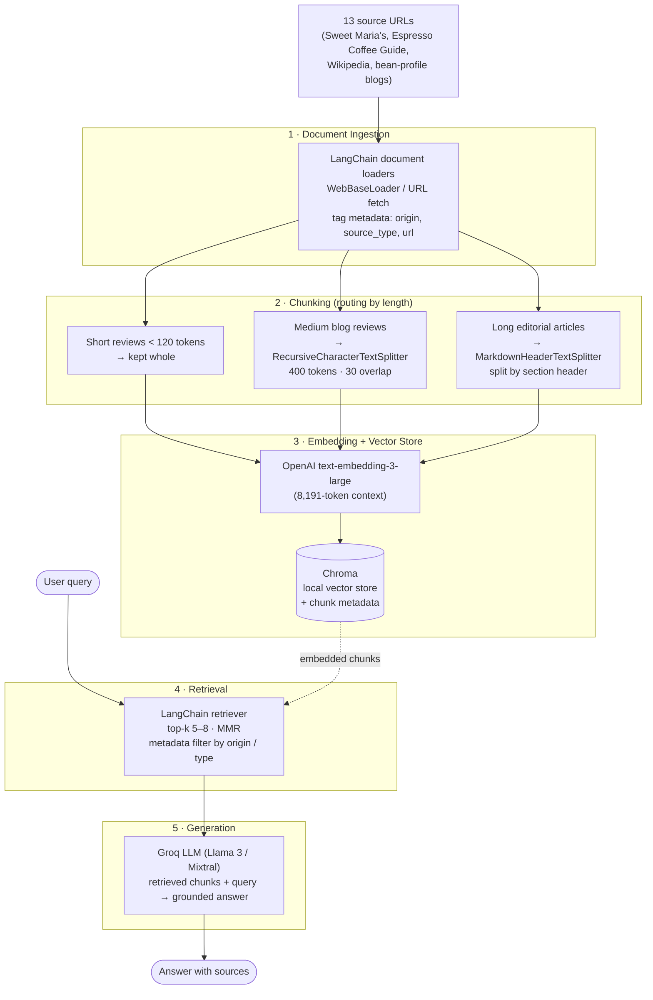

# Project 1 Planning: The Unofficial Guide

> Write this document before you write any pipeline code.
> Your spec and architecture diagram are what you'll use to direct AI tools (Claude, Copilot, etc.) to generate your implementation — the more specific they are, the more useful the generated code will be.
> Update the Retrieval Approach and Chunking Strategy sections if you change your approach during implementation.
> Update this file before starting any stretch features.

---

## Domain

<!-- What domain did you choose? Why is this knowledge valuable and hard to find through official channels? -->
Regional flavor profiles of coffee

This knowledge is valuable because most coffee drinkers encounter tasting notes every day (on bags, menus, and roaster websites) but have no framework for making sense of them. Knowing that Ethiopian coffees tend toward floral and fruity while Sumatran coffees lean earthy and full-bodied gives you a mental model that applies across every cup you'll ever drink.

It's hard to find through official channels because the information is scattered and inconsistent. Roasters write tasting notes to sell their specific product, not to teach the underlying patterns. The Specialty Coffee Association has rigorous educational materials, but they're designed for industry professionals, not everyday drinkers. No single authoritative source draws the complete map — you have to triangulate across dozens of roasters, importers, and review sites to piece it together yourself.
---

## Documents

<!-- List your specific sources: URLs, subreddit names, forum threads, or file descriptions.
     Aim for at least 10 sources that together cover different subtopics or perspectives within your domain. -->

| # | Source | Description | URL or location |
|---|--------|-------------|-----------------|
| 1 | Espresso Coffee Guide| Costa Rica Coffee | https://espressocoffeeguide.com/gourmet-coffee/coffees-of-the-americas/costa-rica-coffee/ |
| 2 | Wikipedia - History of Coffee | A history of coffee and how different coffee beans grew from its origins  | https://en.wikipedia.org/wiki/History_of_coffee |
| 3 | Sweet Maria's | Brazil Coffee bean profile | https://library.sweetmarias.com/coffee-producing-countries/south-america/brazil-coffee-overview/ |
| 4 | Coffee Review | Kenneth Davids' long-running review site with thousands of scored coffees organized by origin | coffeereview.com |
| 5 | Cooper Coffee Co. | Columbian Coffee profile | https://www.cooperscoffeeco.com/discover-the-rich-flavors-what-does-colombian-coffee-taste-like/?srsltid=AfmBOoqFCzpmkRplljGdNdaaTQyQZ2x1HSRrR-zLVM15AFfF7d8Gvrgo |
| 6 | Kona Farm Direct | Hawaii Coffee Beans  | https://www.konafarmdirect.com/post/the-ultimate-guide-to-kona-coffee-what-makes-it-the-world-s-most-sought-after-bean |
| 7 | Sweet Maria's  |  Sumatra Coffee | https://library.sweetmarias.com/coffee-producing-countries/indonesia-se-asia/sumatra-coffee-overview/ |
| 8 | Lavazz | Comparison of Arabica vs Robusta | https://www.lavazzausa.com/en/recipes-and-coffee-hacks/difference-type-arabica-robusta-coffee|
| 9 | The Extraordinary Rise: How Yunnan Coffee Became Asia’s New Coffee Champion | Yunnan Coffee profile  | https://naturebrewescape.com/the-extraordinary-rise-how-yunnan-coffee-became-asias-new-coffee-champion/|
| 10| Homelandcoffee  | Uganda coffee profile| https://homelandcoffee.co/blogs/our-blog/the-flavor-profile-of-ugandan-coffee?srsltid=AfmBOoroFIhGPOwUCy1CI0jJrK29wnAiGw6Mu4n7gBtAuiDhUDfcr7Uw |
| 11| Sweet Maria's | Ecuador coffee profile | https://library.sweetmarias.com/coffee-producing-countries/south-america/ecuador-coffee-overview/|
| 12| Sweet Maria's | Kenya Coffee profile | https://library.sweetmarias.com/coffee-producing-countries/africa/kenya-coffee-overview/|
| 13|  Suvie| yirgacheffe coffee | https://blog.suvie.com/a-beginners-guide-to-coffee-ethiopian-yirgacheffe|

---

## Chunking Strategy

<!-- How will you split documents into chunks?
     State your chunk size (in tokens or characters), overlap size, and explain why those
     numbers fit the structure of your documents.
     A review-heavy corpus warrants different chunking than a long FAQ. -->

**Chunk size:** 400

**Overlap:** 30

**Reasoning:** Links are reviews that are considerably long or short in between. For now, 30 overlap is considerate for the blog reviews. Most of the sources are based on different beans, so I have a low overlap.
Chunk size is 400 since reviews are in paragraphs that are either long or short. Its between 300 and 500 chunk size to coose from.

---

## Retrieval Approach

<!-- Which embedding model are you using (e.g., all-MiniLM-L6-v2 via sentence-transformers)?
     How many chunks will you retrieve per query (top-k)?
     If you were deploying this for real users and cost wasn't a constraint, what tradeoffs
     would you weigh in choosing a different embedding model — context length, multilingual
     support, accuracy on domain-specific text, latency? -->

**Embedding model:** bge-large-en-v1.5

**Top-k:** 5

**Production tradeoff reflection:**
Top-k: A balanced value of 5–8 was chosen to retrieve enough chunks to cover multi-aspect coffee queries, such as flavor, origin, and processing, without flooding the LLM with loosely related content that degrades answer quality.
Embedding model: bge-large-en-v1.5 accommodates the mixed-length corpus of short bean reviews and long editorial articles, while delivering stronger accuracy on domain-specific coffee terminology than smaller general-purpose models.

---

## Evaluation Plan

<!-- List your 5 test questions with their expected correct answers.
     Questions should be specific enough that you can judge whether the system's response
     is right or wrong. "What are good dining halls?" is too vague.
     "What do students say about wait times at [dining hall name] during lunch?" is testable. -->

| # | Question | Expected answer |
|---|----------|-----------------|
| 1 | What flavor profile does Ugandan coffee have?| Ugandan coffee has earthy and chocolatey notes|
| 2 | What are the key flavor differences between Arabica and Robusta coffee?| Arabica is generally smoother and sweeter, featuring notes of fruit, berries, and chocolate. In contrast, Robusta is bolder, more bitter, and has an earthy, woody, or sometimes rubbery taste |
| 3 | What does Colombian coffee taste like and what makes it unique?|  Colombian flavor characteristics like mild acidity, caramel sweetness, and nutty notes|
| 4 | What is Kona Coffee? | Kona coffee is a premium, highly sought-after Arabica coffee grown exclusively on the slopes of the Hualalai and Mauna Loa volcanoes in the Kona Districts of Hawaii's Big Island.|
| 5 | What makes Ethiopian Yirgacheffe coffee unique compared to other Ethiopian coffees? |  Yirgacheffe coffee  has floral and citrus flavor profile, tea-like silky body, and an exceptionally high-altitude terroir that slows down coffee cherry maturation|

---

## Anticipated Challenges

<!-- What could go wrong? Name at least two specific risks with reasoning.
     Consider: noisy or inconsistent documents, missing source attribution, off-topic
     retrieval, chunks that split key information across boundaries. -->

1. off-topic retrieval

2. results would be inconsistant

---

## Architecture

<!-- Draw a diagram of your pipeline showing the five stages:
     Document Ingestion → Chunking → Embedding + Vector Store → Retrieval → Generation
     Label each stage with the tool or library you're using.
     You can use ASCII art, a Mermaid diagram, or embed a sketch as an image.
     You'll use this diagram as context when prompting AI tools to implement each stage. -->

---

## AI Tool Plan

<!-- For each part of the pipeline below, describe:
     - Which AI tool you plan to use (Claude, Copilot, ChatGPT, etc.)
     - What you'll give it as input (which sections of this planning.md, which requirements)
     - What you expect it to produce
     - How you'll verify the output matches your spec

     "I'll use AI to help me code" is not a plan.
     "I'll give Claude my Chunking Strategy section and ask it to implement chunk_text()
     with my specified chunk size and overlap" is a plan. -->

**AI tool used across all stages:** Claude (via Claude Code). Claude reads `planning.md` directly as the spec, so each prompt references the relevant section instead of re-pasting it.

**Stage 1 — Document Ingestion**

- *AI tool:* Claude (Claude Code).
- *Input I'll give it:* My *Documents* table (the 13 source URLs and their origins). Prompt: "Implement `ingest.py` using LangChain `WebBaseLoader` to fetch each URL into a `Document`, tagging metadata `origin`, `source_type`, and `url` per the Documents table."
- *Expected output:* `ingest.py` that loads all 13 sources into `Document` objects with the three metadata fields populated.
- *How I'll verify:* Confirm all 13 URLs load without error and that every `Document` carries non-empty `origin`/`source_type`/`url` metadata matching the table.

**Stage 2 — Chunking**

- *AI tool:* Claude (Claude Code).
- *Input I'll give it:* My *Chunking Strategy* section (chunk size 400, overlap 30). Prompt: "Implement `chunk_text()` that routes by length — reviews under 120 tokens kept whole, medium blogs via `RecursiveCharacterTextSplitter` at 400 tokens / 30 overlap, long editorial articles via `MarkdownHeaderTextSplitter` split on section headers."
- *Expected output:* A `chunk_text()` function implementing the length-based routing, plus a printed chunk count per source.
- *How I'll verify:* Confirm the splitter uses my exact 400/30 values (not Claude's defaults), that a long article was split on headers rather than mid-sentence, and that short reviews stay whole.

**Stage 3 — Embedding + Vector Store**

- *AI tool:* Claude (Claude Code).
- *Input I'll give it:* My *Retrieval Approach* section (embedding model). Prompt: "Embed all chunks with OpenAI `text-embedding-3-large` and persist them to a local Chroma store, preserving each chunk's metadata."
- *Expected output:* An `embed_and_store()` step that builds and persists the Chroma collection with metadata attached.
- *How I'll verify:* Check that the Chroma collection count equals the chunk count from Stage 2 and that stored records retain their `origin`/`source_type`/`url` metadata.

**Stage 4 — Retrieval**

- *AI tool:* Claude (Claude Code).
- *Input I'll give it:* My *Retrieval Approach* section (top-k 5–8). Prompt: "Build a LangChain retriever over the Chroma store using MMR with my top-k, and support pre-filtering on `origin`/`source_type` metadata when the query names a specific origin."
- *Expected output:* A `get_retriever()` returning an MMR retriever wired to my top-k with optional metadata filtering.
- *How I'll verify:* Confirm top-k matches my spec (5–8) and run an origin-specific query (e.g. "Sumatra") to confirm the metadata filter narrows results before the vector search.

**Stage 5 — Generation**

- *AI tool:* Claude (Claude Code).
- *Input I'll give it:* My *Architecture* diagram and *Evaluation Plan* (the 5 test questions). Prompt: "Build `generate(query)`: retrieve chunks and pass them to a Groq LLM (Llama 3 / Mixtral) in a structured prompt that instructs the model to answer **only** from the provided chunks and cite the `url` of each chunk used. Wrap it in a minimal CLI/Streamlit interface."
- *Expected output:* A `generate(query)` function with a grounding system prompt and source citations, plus a minimal interface.
- *How I'll verify:* Run all 5 Evaluation Plan questions against my expected answers, confirm each response cites source URLs, and confirm an off-domain question (e.g. "How do I brew espresso?") is declined rather than hallucinated.

**Milestone 3 — Ingestion and chunking:**

**Milestone 4 — Embedding and retrieval:**

**Milestone 5 — Generation and interface:**
